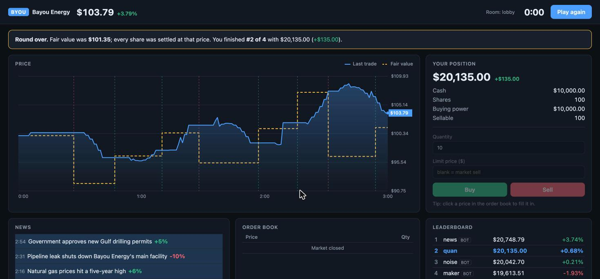

# Real-Time Multiplayer Trading Game

[](https://github.com/quannguyen0527/trading-game/actions/workflows/tests.yml)

A multiplayer stock-trading game built on a from-scratch **limit order book matching engine**. Players join a room, start with $10,000 and 100 shares of Bayou Energy (BYOU), and trade against each other in real time over WebSockets.

## How to play

Each round lasts 3 minutes. The stock has a **hidden fair value**, and every 15–30 seconds a news headline moves it ("OPEC announces production cut" pushes it up, "Hurricane forecast to hit Gulf Coast refineries" pushes it down). When the round ends, every share is settled at the fair value, which is then revealed along with each headline's real impact. Whoever reads the news and trades on it first finishes with the highest net worth.

You're never alone: every room has three **bot traders**. A market maker always quotes a buy and a sell price, a news trader reacts to headlines a few seconds late, and a noise trader adds random small orders. Beat the news bot to the market maker's stale quotes to win.

**Tech:** Python 3.13 · FastAPI · WebSockets · vanilla JavaScript · HTML canvas · unittest



## Features

- **Matching engine** with price-time priority, the same rule real exchanges use: the best price trades first, and ties go to the earliest order.
- **Limit and market orders**, partial fills, cancels, and aggregated order-book depth.
- **Pre-trade risk checks:** cash and shares committed to open orders are reserved, so players can't double-spend.
- **Timed rounds with news events** that move a hidden fair value; open orders are cancelled and shares settled at fair value when the round ends.
- **Bot traders** (market maker, news trader, noise trader) that trade through the same risk checks as humans.
- **Real-time updates:** every player sees the order book, trades, news, and leaderboard update instantly.
- **Live price chart drawn on a plain `<canvas>`** (no chart library). When the round ends it overlays the hidden fair value, so you can see how fast the market priced in each headline.
- **Trading-terminal UI:** order book with depth bars (click a price to use it), one-click Buy/Sell, position and P&L panel, and a layout that works on phones.
- **43 unit and integration tests**, run by GitHub Actions on every push, including two simulated players trading over live WebSocket connections, a fake clock that plays a full 3-minute round instantly, and a check that a full round of bot trading never creates or destroys cash or shares.

## How the matching engine works

```
           ASKS (sellers, min-heap)          best ask = lowest price to buy at
           $101.00   x 5
           $100.50   x 12   <-- best ask
  spread ─────────────────
           $100.00   x 8    <-- best bid
           $ 99.50   x 20
           BIDS (buyers, max-heap)           best bid = highest price to sell at
```

- Bids live in a **max-heap** and asks in a **min-heap**, so the best price on each side can be found in O(1) and added or removed in O(log n).
- An incoming order trades against the opposite side while the prices cross (bid ≥ ask). Each trade executes at the **resting order's price**.
- **Lazy cancellation:** cancelling only marks the order. It is discarded when it reaches the top of its heap, so cancel is O(1) instead of an O(n) heap search.
- **Prices are integer cents**, avoiding floating-point errors (in floating point, `0.1 + 0.2 != 0.3`).

## Design decisions

- **The engine, the game rules and the web server are separate layers.** `engine/` is pure data structures with no I/O, `server/game.py` holds the game rules and accounting, and `server/app.py` is only networking. Each layer can be tested on its own.
- **No locks needed:** the server runs on a single asyncio event loop, and room updates are synchronous, so two players' orders can never interleave mid-update.
- **Time and randomness are injected.** `Room` takes a `clock` and a random generator instead of calling `time` and `random` directly. Tests pass a fake clock they move by hand and a seeded generator, so news timing and round endings are deterministic and instant to test.
- **The server drives the clock.** While a round runs, a background asyncio task calls `room.tick()` once a second; news and the end of the round reach players without anyone sending a message. The client only receives `seconds_left` and counts down locally, so the server doesn't need to broadcast every second.
- **The bots recreate a real market effect called adverse selection.** The market maker ignores the news, so right after a headline its quotes are stale and better-informed traders pick them off. In simulated bot-only rounds the news trader finishes first and the market maker last, and the price follows fair value with a lag of a few percent. That lag is the human player's opportunity.
- **Bots are ordinary accounts.** They place orders through `Room.place_order`, so they can't break the cash and share rules. Their names (`[bot] maker`) contain characters human names can't use, so nobody can log in as a bot.
- **Settling at fair value, not last price,** stops a player from winning by printing one trade at a silly price just before the bell.
- **Market buys are disabled for now:** without a price, an order's cost can't be checked against buying power up front. Planned fix: reserve cash against the current best ask. A market sell with no buyers in the book is rejected with a message instead of silently doing nothing.
- **Safe to run on the public internet:** caps on rooms (50) and players per room (20), a per-connection rate limit (10 messages/second), and empty rooms are deleted so memory can't grow forever.
- **One process by design.** Game state lives in memory, which keeps every order fast and the code simple, but means the server can't be split across several processes. Scaling out would mean pinning each room to one server, or moving state to something like Redis.
- **The chart's data is sampled once a second on the server,** so a round's history is at most 181 points no matter how many trades happen, and every broadcast stays small.

## Deploy

The repo includes a [Render](https://render.com) Blueprint (`render.yaml`): connect the GitHub repo in Render, and every push to `main` deploys automatically. Any host that runs a long-lived Python process with WebSockets works with the start command:

```bash
uvicorn server.app:app --host 0.0.0.0 --port $PORT
```

## Run it locally

```bash
python3 -m venv .venv
.venv/bin/pip install -r requirements.txt
.venv/bin/uvicorn server.app:app --reload
```

Open http://localhost:8000 in two browser tabs, join the same room with different names, press **Start round**, and trade.

Run the tests:

```bash
.venv/bin/python -m unittest -v
```

## Project structure

```
engine/order_book.py   matching engine (heaps, price-time priority)
server/game.py         rounds, news, accounts, risk checks, settlement, leaderboard
server/bots.py         market maker, news trader and noise trader bots
server/app.py          FastAPI + WebSocket server
static/                browser client (index.html, style.css, app.js with the canvas chart)
tests/                 engine, game-rule, bot and WebSocket tests
```

## Roadmap

- [x] Timed rounds and random news events that move the stock's value
- [x] Bot traders so the market is active when you play alone
- [x] Polished UI with a live price chart
- [ ] Port the matching engine to C++ (pybind11) and benchmark the speedup
- [x] Deploy config (Render Blueprint, health check, CI)
